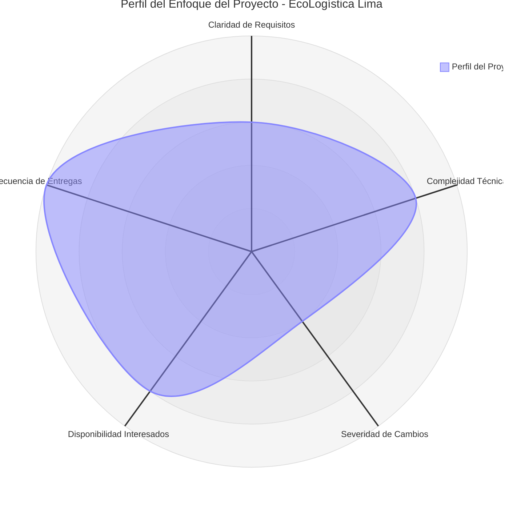

# Selección del Enfoque del Proyecto

## 1. Encabezado de Metadatos

| Campo | Detalle |
|---|---|
| **Nombre del Proyecto** | EcoLogística Lima – Optimizador de Rutas Sostenibles para DistriRápido S.A.C. |
| **Integrantes** | Jhunior Harold Cosme Tenorio (DNI 75262183) · Jhanpool Ernesto Flores Torres (DNI 7843259) · Ricardo David Tucto Ubaldo (DNI 72120490) · Andrew Steven Vega Reyes (DNI 72638273) |
| **Fecha** | 27/08/2026 |
| **Versión** | 1.0.0 |

## 2. Matriz de Ponderación de Variables

Para determinar el enfoque de gestión más adecuado, el equipo evaluó cinco variables clave del proyecto en una escala del **1 al 5**, donde **1** indica una condición que favorece un enfoque **predictivo** (alta estabilidad, bajo cambio, control estricto) y **5** indica una condición que favorece un enfoque **ágil** (alta incertidumbre, alto valor de la retroalimentación temprana e iterativa).

| N° | Variable | Puntaje (1-5) | Justificación |
|---|---|:---:|---|
| 1 | Claridad y estabilidad de requisitos | 3 | El problema central (optimizar rutas de reparto reduciendo costos y huella de carbono) está claro, pero los criterios exactos de "sostenibilidad" (peso relativo de CO₂ vs. tiempo vs. costo) y el detalle de las funcionalidades del PMV se afinarán junto con DistriRápido S.A.C. a medida que se validen prototipos. |
| 2 | Complejidad técnica e innovación | 4 | Requiere algoritmos de optimización de rutas (heurísticas del tipo VRP/TSP), integración con APIs de geolocalización y cálculo de métricas ambientales, lo que exige experimentación e iteración técnica. |
| 3 | Severidad del impacto ante cambios | 2 | Al ser un Producto Mínimo Viable académico (no un sistema en producción crítica para el negocio real), el costo de un cambio tardío es moderado; sin embargo, el cronograma de 12 semanas es fijo e innegociable, lo que exige puntos de control predictivos por hito. |
| 4 | Disponibilidad de los interesados (stakeholders) | 4 | El equipo tiene acceso directo y frecuente al docente del curso (validador principal) y puede gestionar retroalimentación continua simulando al cliente (DistriRápido S.A.C.), habilitando ciclos cortos de revisión. |
| 5 | Frecuencia de entregas de valor | 5 | La consigna exige evidenciar "evolución progresiva del PMV" a lo largo de las 12 semanas, es decir, entregas incrementales y frecuentes de funcionalidad utilizable. |

**Puntaje promedio: 3.6 / 5**

## 3. Diagrama de Radar del Enfoque

### 3.1. Tabla descriptiva detallada (representación visual del perfil)

| Variable | Puntaje | Perfil visual (escala 0 a 5) | Tendencia dominante |
|---|:---:|---|---|
| Claridad y estabilidad de requisitos | 3/5 | ███░░ | Híbrida |
| Complejidad técnica e innovación | 4/5 | ████░ | Ágil |
| Severidad del impacto ante cambios | 2/5 | ██░░░ | Predictiva |
| Disponibilidad de interesados | 4/5 | ████░ | Ágil |
| Frecuencia de entregas de valor | 5/5 | █████ | Ágil |

El perfil resultante muestra que **3 de las 5 variables** (complejidad técnica, disponibilidad de interesados y frecuencia de entregas) se ubican en zona claramente ágil, **1 variable** (severidad del impacto ante cambios) se ubica en zona predictiva, y **1 variable** (claridad de requisitos) se ubica en zona intermedia/híbrida. Esta distribución descarta un enfoque puramente predictivo o puramente ágil y sustenta la elección de un enfoque **híbrido**, con predominancia ágil en la ejecución técnica.

### 3.2. Código Mermaid (gráfico de radar)

> Nota: se incluye de forma complementaria el código en formato Mermaid para los visores que soporten el tipo de diagrama `radar-beta`. La tabla de la sección 3.1 constituye la representación oficial y autocontenida de este documento, válida independientemente del soporte de renderizado del visor utilizado.

## 4. Decisión y Justificación del Enfoque

### Enfoque seleccionado: **HÍBRIDO**

De acuerdo con la *Guía del PMBOK® – 7ª Edición*, la selección del enfoque de desarrollo y ciclo de vida debe adaptarse ("tailoring") a las características específicas de cada proyecto, en lugar de aplicar un modelo único de forma rígida. El estándar reconoce explícitamente los ciclos de vida híbridos como una combinación válida de elementos predictivos y adaptativos, seleccionados en función del dominio de desempeño "Enfoque de Desarrollo y Ciclo de Vida" y del principio de adaptar la gestión al contexto del proyecto.

Para **EcoLogística Lima**, el equipo adoptará un modelo híbrido estructurado en dos capas:

- **Capa predictiva (gobierno del proyecto):** cronograma general de 12 semanas dividido en fases con hitos fijos, documentación formal de la fase de inicio alineada a PMBOK (Acta de Constitución, Declaración de Visión, Registro de Interesados, Registro de Supuestos y Restricciones), y control de alcance mediante versionado semántico (PMV etiquetado como v1.0.0).
- **Capa ágil (ejecución técnica):** desarrollo del software mediante iteraciones cortas tipo sprint, con entregas incrementales del frontend y backend, retroalimentación continua mediante *pull requests*, y priorización flexible del backlog de funcionalidades conforme avanza el aprendizaje técnico sobre los algoritmos de ruteo.

**Justificación técnica:**

1. El puntaje promedio de la matriz de ponderación (3.6/5) indica una inclinación hacia lo ágil, pero la variable "Severidad del impacto ante cambios" (2/5) revela la necesidad de puntos de control predictivos, dado el plazo académico fijo e inamovible de 12 semanas.
2. La consigna del curso exige simultáneamente artefactos de gestión predictivos tradicionales (Acta de Constitución, hitos, presupuesto) **y** evidencia de evolución iterativa del producto (commits distribuidos, PMV progresivo) — una dualidad que el PMBOK 7 resuelve mediante ciclos de vida híbridos.
3. La complejidad técnica del algoritmo de optimización de rutas (variable 2, puntaje 4/5) requiere descubrimiento y ajuste progresivo, característico de los enfoques adaptativos, mientras que la obligación de reportar avances por hito ante el equipo docente exige puntos de control predictivos periódicos.
4. Este enfoque está alineado con el principio de PMBOK 7 de "adaptar el enfoque según el contexto" del proyecto, maximizando el valor entregado en cada iteración sin sacrificar la trazabilidad y el control exigidos por la rúbrica del curso.
5. Operativamente, el equipo aplicará **Scrum/Kanban** para la gestión del desarrollo (sprints quincenales, tablero de tareas) dentro del marco de gobierno predictivo fijado por el cronograma de 12 semanas y los hitos institucionales.
