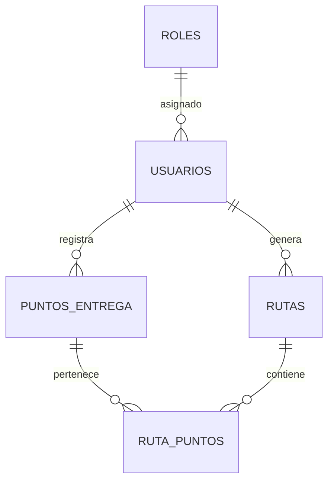

# Documento 06: Diseño e Ingeniería de Base de Datos

**Proyecto:** EcoLogística Lima – Optimizador de Rutas Sostenibles para DistriRápido S.A.C.
**Versión:** 1.0.0 | **Fecha:** 27/08/2026

---

## 1. Modelo Conceptual (Diagrama ER)

El modelo conceptual representa las entidades principales del sistema **EcoLogística Lima** y sus relaciones. El modelo se ha delimitado al alcance del **Producto Mínimo Viable (PMV)**, incluyendo las entidades necesarias para: autenticar usuarios, registrar puntos de entrega, generar rutas optimizadas y calcular los indicadores. Se mantiene la normalización a la **Tercera Forma Normal (3FN)** para evitar datos repetidos y garantizar la consistencia.



- Un **Rol** se asigna a uno o muchos **Usuarios** (1:N).
- Un **Usuario** (operador) registra uno o muchos **Puntos de Entrega** (1:N).
- Un **Usuario** (operador) genera una o muchas **Rutas** (1:N).
- Una **Ruta** contiene muchos **Puntos de Entrega** mediante la tabla intermedia **Ruta_Puntos** (N:M), donde cada punto tiene un orden de visita.
- Un **Punto de Entrega** puede pertenecer a una o muchas **Rutas** a lo largo del tiempo (a través de Ruta_Puntos).

---

## 2. Modelo Lógico

### 2.1 Tabla: ROLES

| Atributo | Tipo | Restricción | Descripción |
|---|---|---|---|
| id_rol | SERIAL | **PK** | Identificador único del rol |
| nombre | VARCHAR(50) | NOT NULL, UNIQUE | Nombre del rol (Administrador, Operador, Gerente) |
| descripcion | VARCHAR(255) | NULL | Descripción opcional del rol |

### 2.2 Tabla: USUARIOS

| Atributo | Tipo | Restricción | Descripción |
|---|---|---|---|
| id_usuario | UUID | **PK** | Identificador único del usuario |
| nombre | VARCHAR(100) | NOT NULL | Nombre completo del usuario |
| correo | VARCHAR(150) | NOT NULL, UNIQUE | Correo electrónico de acceso |
| contrasena_hash | VARCHAR(255) | NOT NULL | Contraseña hasheada (bcrypt) |
| id_rol | INTEGER | **FK** → ROLES.id_rol | Rol asignado al usuario |
| fecha_creacion | TIMESTAMPTZ | NOT NULL, DEFAULT now() | Fecha de creación del registro |

### 2.3 Tabla: PUNTOS_ENTREGA

| Atributo | Tipo | Restricción | Descripción |
|---|---|---|---|
| id_punto | UUID | **PK** | Identificador único del punto de entrega |
| direccion | VARCHAR(255) | NOT NULL | Dirección del punto de entrega |
| latitud | DECIMAL(10,7) | NOT NULL | Coordenada de latitud |
| longitud | DECIMAL(10,7) | NOT NULL | Coordenada de longitud |
| peso_kg | DECIMAL(10,3) | NOT NULL, CHECK (peso_kg > 0) | Peso del paquete en kilogramos |
| destinatario | VARCHAR(150) | NOT NULL | Nombre del destinatario |
| id_operador | UUID | **FK** → USUARIOS.id_usuario | Operador que registró el punto |
| fecha_registro | TIMESTAMPTZ | NOT NULL, DEFAULT now() | Fecha de registro del punto |

### 2.4 Tabla: PARAMETROS_VEHICULO

| Atributo | Tipo | Restricción | Descripción |
|---|---|---|---|
| id_vehiculo | SERIAL | **PK** | Identificador único del vehículo |
| placa | VARCHAR(20) | NOT NULL, UNIQUE | Placa del vehículo |
| capacidad_kg | DECIMAL(10,3) | NOT NULL, CHECK (capacidad_kg > 0) | Capacidad máxima de carga |
| factor_emision_co2 | DECIMAL(6,3) | NOT NULL, CHECK (factor_emision_co2 > 0) | Factor de emisión de CO₂ (kg/litro) |
| velocidad_promedio_kmh | DECIMAL(6,2) | NOT NULL, CHECK (velocidad_promedio_kmh > 0) | Velocidad promedio de recorrido |
| tipo_combustible | VARCHAR(30) | NOT NULL | Tipo de combustible del vehículo |

### 2.5 Tabla: RUTAS

| Atributo | Tipo | Restricción | Descripción |
|---|---|---|---|
| id_ruta | UUID | **PK** | Identificador único de la ruta |
| id_operador | UUID | **FK** → USUARIOS.id_usuario | Operador que generó la ruta |
| id_vehiculo | INTEGER | **FK** → PARAMETROS_VEHICULO.id_vehiculo | Vehículo asignado a la ruta |
| distancia_total_km | DECIMAL(10,3) | NOT NULL, CHECK (>= 0) | Distancia total recorrida |
| tiempo_estimado_min | DECIMAL(10,2) | NOT NULL, CHECK (>= 0) | Tiempo estimado en minutos |
| co2_estimado_kg | DECIMAL(10,3) | NOT NULL, CHECK (>= 0) | Emisiones estimadas de CO₂ en kg |
| co2_sin_optimizar_kg | DECIMAL(10,3) | NOT NULL, CHECK (>= 0) | Emisiones de la ruta no optimizada |
| estado | VARCHAR(20) | NOT NULL, DEFAULT 'Borrador', CHECK (estado IN ('Borrador','Confirmada')) | Estado de la ruta |
| fecha_generacion | TIMESTAMPTZ | NOT NULL, DEFAULT now() | Fecha de generación de la ruta |

### 2.6 Tabla: RUTA_PUNTOS (Tabla Intermedia)

| Atributo | Tipo | Restricción | Descripción |
|---|---|---|---|
| id_ruta_punto | UUID | **PK** | Identificador único |
| id_ruta | UUID | **FK** → RUTAS.id_ruta | Ruta a la que pertenece |
| id_punto | UUID | **FK** → PUNTOS_ENTREGA.id_punto | Punto de entrega incluido |
| orden | INTEGER | NOT NULL, CHECK (orden > 0) | Orden de visita del punto en la ruta |

### 2.7 Cumplimiento de la Tercera Forma Normal (3FN)

| Entidad | ¿1FN? | ¿2FN? | ¿3FN? | Justificación |
|---|---|:---:|:---:|:---:|---|
| ROLES | Sí | Sí | Sí | Atributos atómicos, dependen de la PK (id_rol) |
| USUARIOS | Sí | Sí | Sí | Todos los atributos dependen de id_usuario; no hay dependencias transitivas |
| PUNTOS_ENTREGA | Sí | Sí | Sí | La FK id_operador es solo referencia, no crea dependencias transitivas |
| PARAMETROS_VEHICULO | Sí | Sí | Sí | Atributos dependen de la PK (id_vehiculo) |
| RUTAS | Sí | Sí | Sí | Los totales (distancia, tiempo, CO₂) se calculan y almacenan como resultado, no se derivan de otras tablas de forma transitiva |
| RUTA_PUNTOS | Sí | Sí | Sí | Tabla intermedia con PK propia; relaciona rutas y puntos sin redundancia |

---

## 3. Modelo Físico (DDL SQL)

```sql
-- ============================================================
-- EcoLogística Lima - Modelo Físico de Base de Datos (PostgreSQL)
-- Versión v1.0.0
-- ============================================================

-- Extensión para generar identificadores UUID
CREATE EXTENSION IF NOT EXISTS "pgcrypto";

-- ------------------------------------------------------------
-- Tabla: ROLES
-- ------------------------------------------------------------
CREATE TABLE roles (
    id_rol       SERIAL PRIMARY KEY,
    nombre       VARCHAR(50) NOT NULL UNIQUE,
    descripcion  VARCHAR(255)
);

-- ------------------------------------------------------------
-- Tabla: USUARIOS
-- ------------------------------------------------------------
CREATE TABLE usuarios (
    id_usuario       UUID PRIMARY KEY DEFAULT gen_random_uuid(),
    nombre           VARCHAR(100) NOT NULL,
    correo           VARCHAR(150) NOT NULL UNIQUE,
    contrasena_hash  VARCHAR(255) NOT NULL,
    id_rol           INTEGER NOT NULL REFERENCES roles(id_rol),
    fecha_creacion   TIMESTAMPTZ NOT NULL DEFAULT now()
);

-- ------------------------------------------------------------
-- Tabla: PUNTOS_ENTREGA
-- ------------------------------------------------------------
CREATE TABLE puntos_entrega (
    id_punto       UUID PRIMARY KEY DEFAULT gen_random_uuid(),
    direccion      VARCHAR(255) NOT NULL,
    latitud        DECIMAL(10,7) NOT NULL,
    longitud       DECIMAL(10,7) NOT NULL,
    peso_kg        DECIMAL(10,3) NOT NULL CHECK (peso_kg > 0),
    destinatario   VARCHAR(150) NOT NULL,
    id_operador    UUID NOT NULL REFERENCES usuarios(id_usuario),
    fecha_registro TIMESTAMPTZ NOT NULL DEFAULT now()
);

-- ------------------------------------------------------------
-- Tabla: PARAMETROS_VEHICULO
-- ------------------------------------------------------------
CREATE TABLE parametros_vehiculo (
    id_vehiculo            SERIAL PRIMARY KEY,
    placa                  VARCHAR(20) NOT NULL UNIQUE,
    capacidad_kg           DECIMAL(10,3) NOT NULL CHECK (capacidad_kg > 0),
    factor_emision_co2     DECIMAL(6,3) NOT NULL CHECK (factor_emision_co2 > 0),
    velocidad_promedio_kmh DECIMAL(6,2) NOT NULL CHECK (velocidad_promedio_kmh > 0),
    tipo_combustible       VARCHAR(30) NOT NULL
);

-- ------------------------------------------------------------
-- Tabla: RUTAS
-- ------------------------------------------------------------
CREATE TABLE rutas (
    id_ruta              UUID PRIMARY KEY DEFAULT gen_random_uuid(),
    id_operador          UUID NOT NULL REFERENCES usuarios(id_usuario),
    id_vehiculo          INTEGER NOT NULL REFERENCES parametros_vehiculo(id_vehiculo),
    distancia_total_km   DECIMAL(10,3) NOT NULL CHECK (distancia_total_km >= 0),
    tiempo_estimado_min  DECIMAL(10,2) NOT NULL CHECK (tiempo_estimado_min >= 0),
    co2_estimado_kg      DECIMAL(10,3) NOT NULL CHECK (co2_estimado_kg >= 0),
    co2_sin_optimizar_kg DECIMAL(10,3) NOT NULL CHECK (co2_sin_optimizar_kg >= 0),
    estado               VARCHAR(20) NOT NULL DEFAULT 'Borrador'
                         CHECK (estado IN ('Borrador','Confirmada')),
    fecha_generacion     TIMESTAMPTZ NOT NULL DEFAULT now()
);

-- ------------------------------------------------------------
-- Tabla: RUTA_PUNTOS (tabla intermedia)
-- ------------------------------------------------------------
CREATE TABLE ruta_puntos (
    id_ruta_punto  UUID PRIMARY KEY DEFAULT gen_random_uuid(),
    id_ruta        UUID NOT NULL REFERENCES rutas(id_ruta),
    id_punto       UUID NOT NULL REFERENCES puntos_entrega(id_punto),
    orden          INTEGER NOT NULL CHECK (orden > 0)
);

-- ------------------------------------------------------------
-- Índices para optimización de consultas
-- ------------------------------------------------------------
CREATE INDEX idx_usuarios_correo     ON usuarios(correo);
CREATE INDEX idx_usuarios_rol        ON usuarios(id_rol);
CREATE INDEX idx_puntos_operador     ON puntos_entrega(id_operador);
CREATE INDEX idx_rutas_operador      ON rutas(id_operador);
CREATE INDEX idx_rutas_estado        ON rutas(estado);
CREATE INDEX idx_ruta_puntos_ruta    ON ruta_puntos(id_ruta);
CREATE INDEX idx_ruta_puntos_orden   ON ruta_puntos(id_ruta, orden);
```

---

## 4. Notas y Buenas Prácticas

| ID | Nota |
|---|---|
| NOT-01 | Se utilizan **UUID** como claves primarias en las tablas transaccionales (usuarios, puntos, rutas) para evitar colisiones y facilitar la trazabilidad, mientras que se usan **SERIAL** en las tablas de catálogo de bajo volumen (roles, vehículos). |
| NOT-02 | Los campos de fecha usan **TIMESTAMPTZ** (con zona horaria) para registrar correctamente la hora local de Lima en todas las operaciones. |
| NOT-03 | Las restricciones **CHECK** garantizan valores válidos (peso y capacidad mayores que cero, estado acotado), aplicando las reglas de negocio definidas en el documento de Reglas de Negocio (RN-008, RN-014). |
| NOT-04 | Los índices facilitan las consultas frecuentes (búsqueda por correo, listado de rutas por operador y por estado), mejorando el rendimiento con un costo de almacenamiento mínimo. |
| NOT-05 | El modelo se restringe al alcance del PMV. Las tablas avanzadas del SPECS (conductores, zonas, entidades de incidencias complejas) se dejan para versiones posteriores y no se incluyen en esta versión. |
| NOT-06 | El factor de emisión de CO₂ y la velocidad promedio son parámetros configurables por vehículo, lo que permite estimar distancia, tiempo y emisiones según las reglas de cálculo de las Reglas de Negocio (RN-015, RN-016, RN-017). |
