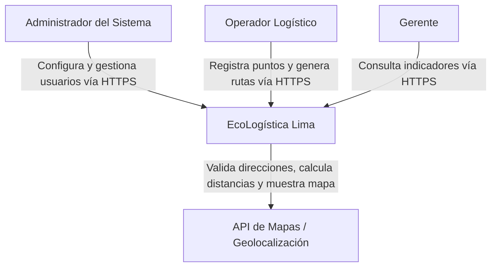
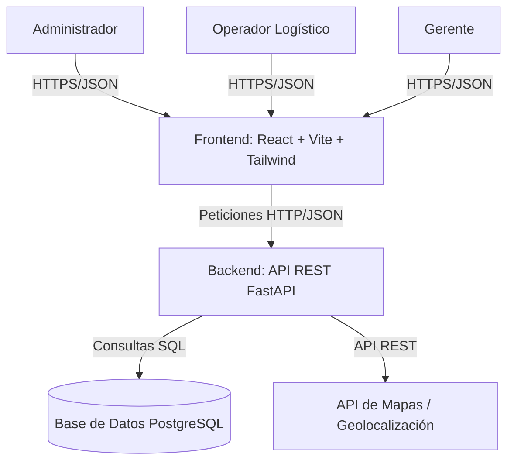
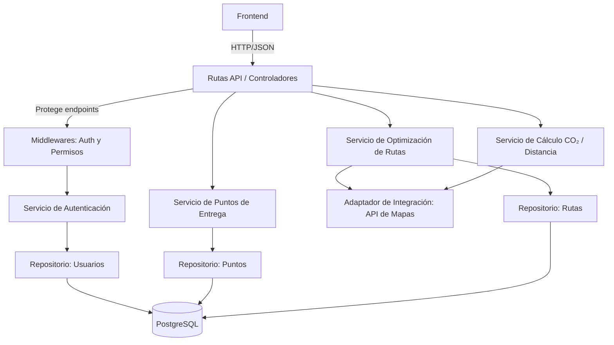

# Documento 07: Arquitectura de Software - Modelo C4

**Proyecto:** EcoLogística Lima – Optimizador de Rutas Sostenibles para DistriRápido S.A.C.
**Versión:** 1.0.0 | **Fecha:** 27/08/2026

---

## 1. Nivel 1: Diagrama de Contexto del Sistema

El Nivel 1 muestra el sistema **EcoLogística Lima** como una única caja, junto con los actores que lo usan y los servicios externos con los que se comunica. Los actores directos son el **Administrador** (configura el sistema y gestiona usuarios), el **Operador Logístico** (registra puntos y genera rutas) y el **Gerente** (consulta indicadores). El único servicio externo de terceros es la **API de Mapas/Geolocalización**, la cual valida direcciones, calcula distancias y permite visualizar la ruta sobre un mapa. Todo el tráfico se realiza mediante **HTTPS**.

**Tabla explicativa Nivel 1:**

| Elemento | Rol / Tipo | Función y Responsabilidad | Protocolo |
|---|---|---|---|
| Administrador del Sistema | Actor (Usuario) | Configura el centro de distribución, gestiona usuarios y roles, define parámetros del sistema | HTTPS |
| Operador Logístico | Actor (Usuario) | Registra puntos de entrega, genera rutas optimizadas, confirma rutas y consulta historial | HTTPS |
| Gerente | Actor (Usuario) | Consulta rutas históricas, indicadores de sostenibilidad y distancia total | HTTPS |
| EcoLogística Lima | Sistema | Aplicación web que calcula rutas optimizadas y evalúa su impacto ambiental | HTTPS |
| API de Mapas / Geolocalización | Sistema externo | Proporciona geolocalización, cálculo de distancias y visualización de rutas en mapa | API REST (gratuita) |

---

## 2. Nivel 2: Diagrama de Contenedores

El Nivel 2 muestra los tres contenedores principales que componen el sistema: el **Frontend** (Interfaz de Usuario, construida con React y Vite), el **Backend** (API REST desarrollada con FastAPI, que contiene toda la lógica de negocio y de optimización) y la **Base de Datos** (PostgreSQL, donde se almacenan usuarios, puntos, rutas y parámetros). El Frontend se comunica con el Backend mediante **peticiones HTTP/JSON**, y el Backend con la Base de Datos mediante **SQL** (a través del ORM SQLAlchemy).

**Tabla explicativa Nivel 2:**

| Contenedor | Rol / Tipo | Función y Responsabilidad | Protocolo de Comunicación |
|---|---|---|---|
| Frontend: Interfaz Web | Aplicación SPA (React + Vite + Tailwind) | Muestra las pantallas (login, registro de puntos, generación de rutas, mapa, indicadores) e interactúa con el usuario | HTTPS / JSON |
| Backend: API REST | Servidor Backend (FastAPI) | Implementa la lógica de negocio: autenticación, validación, cálculo de rutas, Cálculo de distancia/tiempo/CO₂ y expone la API | HTTP / JSON (documentado con Swagger) |
| Base de Datos | Almacén de datos (PostgreSQL) | Almacena usuarios, roles, puntos de entrega, parámetros de vehículo, rutas y la tabla intermedia de rutas-puntos | SQL (SQLAlchemy) |
| API de Mapas / Geolocalización | Sistema externo | Provee geolocalización de direcciones y cálculo de distancias | API REST (gratuita) |

---

## 3. Nivel 3: Diagrama de Componentes del Backend

El Nivel 3 muestra la estructura interna del **Backend**, organizado en capas con separación de responsabilidades. Los **Controladores (Rutas API)** reciben las peticiones del Frontend; los **Middlewares** verifican la autenticación y los permisos; los **Servicios de Negocio** implementan la lógica (optimización de rutas, cálculo de CO₂, autenticación); los **Repositorios / Acceso a Datos** gestionan el guardado y consulta de información en PostgreSQL; y el **Adaptador de Integración** se comunica con la API de Mapas externa.

**Tabla explicativa Nivel 3:**

| Componente | Tipo / Capa | Función y Responsabilidad | Se Comunica con |
|---|---|---|---|
| Rutas API / Controladores | Capa de Presentación (HTTP) | Recibe las peticiones del Frontend, valida el formato y las redirige al servicio correspondiente | Frontend, Middlewares |
| Middlewares: Auth y Permisos | Capa de Control (Seguridad) | Verifica el token (JWT) y comprueba que el rol tenga permiso para la operación | Rutas API, Servicio de Autenticación |
| Servicio de Autenticación | Capa de Negocio | Valida credenciales, emite el token y gestiona el registro de usuarios | Middlewares, Repositorio de Usuarios |
| Servicio de Puntos de Entrega | Capa de Negocio | Registra, actualiza y elimina puntos de entrega respetando las reglas de negocio | Repositorio de Puntos |
| Servicio de Optimización de Rutas | Capa de Negocio | Calcula la secuencia de menor distancia usando el algoritmo y respetando la capacidad del vehículo | Repositorio de Rutas, Adaptador de Mapas |
| Servicio de Cálculo CO₂ / Distancia | Capa de Negocio | Calcula distancia total, tiempo estimado y emisiones de CO₂ según las reglas de negocio | Adaptador de Mapas, Repositorio de Rutas |
| Adaptador de Integración: API de Mapas | Capa de Integración | Se comunica con la API de Mapas externa para geocodificar direcciones y calcular distancias | API de Mapas |
| Repositorio: Usuarios / Puntos / Rutas | Capa de Datos | Ejecuta consultas y guardados en la base de datos mediante SQLAlchemy | Base de Datos PostgreSQL |
| Base de Datos PostgreSQL | Almacén de datos | Persiste usuarios, puntos, rutas y parámetros de vehículo | Todos los Repositorios |

---

## 4. Resumen de la Arquitectura

| Nivel C4 | Descripción | Elementos Principales |
|---|:---:|---|
| Nivel 1: Contexto | Límites del sistema y actores externos | Administrador, Operador, Gerente, API de Mapas |
| Nivel 2: Contenedores | Aplicaciones y datos desplegables | Frontend (React), Backend (FastAPI), PostgreSQL |
| Nivel 3: Componentes | Estructura interna del Backend | Controladores, Middlewares, Servicios, Repositorios, Adaptador |

La arquitectura sigue el patrón de **separación de responsabilidades por capas**: la interfaz (Frontend) no accede a la base de datos directamente, sino a través de la API del Backend; y cada componente interno del Backend tiene una responsabilidad única. Esta organización facilita el mantenimiento, la corrección de errores y la ampliación futura del sistema, en línea con los requisitos de mantenibilidad del proyecto (RNF-011 y RNF-012).
