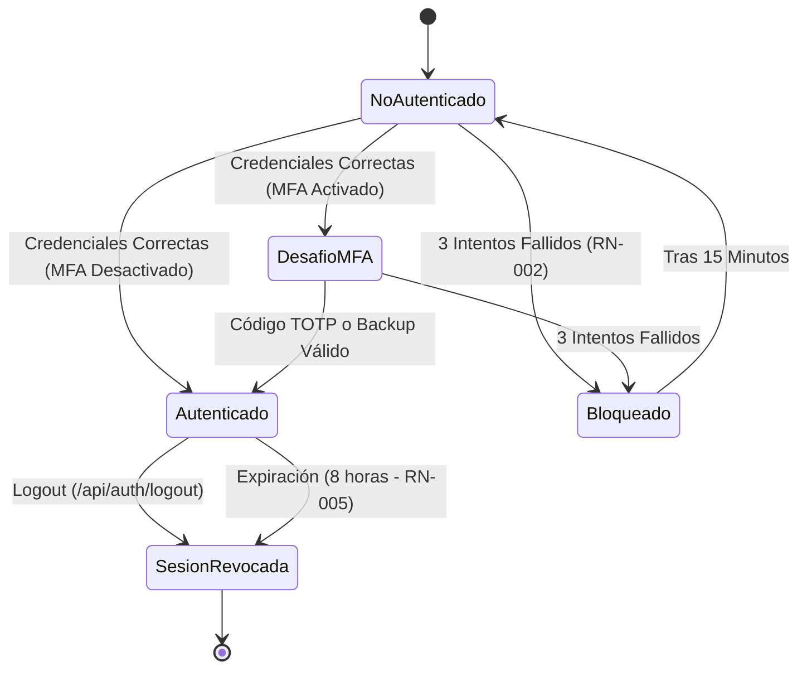

# Documento 14: Especificación de Autenticación MFA y Gestión Segura de Sesiones

[← Volver al README Principal](../../README.md)

**Proyecto:** EcoLogística Lima – Optimizador de Rutas Sostenibles para DistriRápido S.A.C.  
**Versión:** 1.0.0 | **Fecha:** 01/10/2026  
**Autor:** Equipo de Desarrollo (Rama: `flores`)  
**Metodología:** Desarrollo Guiado por Especificaciones (Spec-Driven Development) + OpenSpec + Auditoría con IA

> **Estado de implementación: no implementado.** Este documento es una
> **especificación funcional**. El módulo de MFA con TOTP y la gestión del ciclo de vida
> de sesiones **no tienen implementación** en el backend activo del proyecto
> (`src/backend`), que únicamente implementa autenticación JWT con hash bcrypt y control
> de acceso por rol. La especificación permanece como trabajo pendiente y no debe
> interpretarse como funcionalidad disponible. Se recoge como pendiente en los
> entregables del Sprint 1, en el
> [`02 Registro de Impedimentos V_1_0_0.md`](../03%20Implementación/02%20Registro%20de%20Impedimentos%20V_1_0_0.md)
> (impedimento IMP-08, acción ACT-S1-07).

---

## 1. Introducción y Contexto

El sistema web **EcoLogística Lima** requiere un mecanismo de autenticación y autorización robusto para salvaguardar la información operativa, logística y de los clientes de **DistriRápido S.A.C.**. Debido a que el sistema gestiona asignación de vehículos, conductores, pedidos y rutas urbanas, el acceso no autorizado o el secuestro de sesiones (*session hijacking*) comprometería la continuidad operativa de la empresa.

Este documento establece la especificación formal del módulo de **Autenticación Multifactor (MFA - Multi-Factor Authentication)** basado en TOTP (Time-based One-Time Password, RFC 6238) y la **Gestión Segura del Ciclo de Vida de Sesiones**, aplicando un proceso iterativo de eliminación de ambigüedades y auditoría formal asistida por Inteligencia Artificial.

---

## 2. Proceso de Auditoría con IA: Aplicación del Prompt Maestro

Para asegurar que la especificación cumpla con estándares profesionales de arquitectura y ciberseguridad, se sometió el borrador inicial (`docs/inicio/specs/auth_mfa_borrador.openspec.yaml`) al prompt de auditoría técnica.

### 2.1 Prompt Aplicado

```text
"Actúa como un Auditor Senior de Arquitectura de Software experto en OpenSpec y entornos de desarrollo modernos. 

Te proporcionaré la primera versión de mi archivo de especificación funcional en formato OpenSpec para el módulo web de Autenticación con MFA y Gestión Segura de Sesiones.

Tu tarea NO es redactar la especificación completa por mí ni darme el código final. Tu objetivo es realizar una revisión crítica en tres pasos:

1. Inconsistencias y Ambigüedades: Señala al menos 2 términos ambiguos o reglas no cuantificables en mi especificación.
2. Casos de Borde (Edge Cases): Identifica al menos 2 escenarios de error, concurrencia o seguridad que he omitido en esta especificación.
3. Preguntas de Cuestionamiento: Hazme 2 preguntas incisivas que me obliguen a decidir sobre la arquitectura o restricciones técnicas del entorno (ej. timeouts, manejo de estados, persistencia).

Aquí está mi borrador inicial de OpenSpec:
---
[Borrador: auth_mfa_borrador.openspec.yaml]
---

Respóndeme de forma estructurada, profesional y analítica."
```

---

### 2.2 Informe de la Auditoría Técnica con IA

#### Paso 1: Inconsistencias y Ambigüedades Detectadas
1. **Término No Cuantificable:** *"tiempo razonable de expiración"* en `REQ-AUTH-001`. No define si son minutos u horas, impidiendo pruebas deterministas. Además, *"sesión segura"* no establece el mecanismo de transporte (Cookies con flags HttpOnly/Secure o encabezado `Authorization: Bearer <JWT>`).
2. **Regla Indeterminada de Bloqueo:** *"bloquear el usuario si intenta muchas veces de forma incorrecta"* en `REQ-AUTH-003`. No cuantifica el umbral de intentos fallidos, la ventana de tiempo de observación ni la duración del bloqueo.
3. **Omisión de Estándar Criptográfico:** *"código de 6 dígitos emitido por su aplicación"* en `REQ-AUTH-002`. No especifica el protocolo (TOTP RFC 6238 vs HOTP RFC 4226), el algoritmo criptográfico base (HMAC-SHA1 o HMAC-SHA256), la longitud del secreto ni el paso de tiempo (timestep = 30 segundos).

#### Paso 2: Casos de Borde (Edge Cases) Omitidos
1. **Elevación de Privilegios por Bypass del 2do Factor:** Si el login primario valida contraseña y el usuario tiene MFA activo, ¿qué credencial intermedia se retorna? Si se retorna un token JWT estándar, un atacante que conozca la contraseña podría acceder a las APIs de rutas y pedidos sin ingresar el segundo factor. Debe implementarse un token efímero de desafío (`mfa_token`) con validez estricta de 5 minutos y scope exclusivo para verificación MFA.
2. **Desincronización de Reloj (*Clock Drift*) y Pérdida de Dispositivo:** No se consideraba qué ocurre si el reloj del celular del usuario difiere por unos segundos del servidor (requiere tolerancia de ventana ±1 intervalo de 30s) ni qué ocurre si el operador pierde o daña su teléfono (se requiere generación de 5 códigos de recuperación / *backup recovery codes* de un solo uso).
3. **Tokens Zombie post-Logout (Falta de Revocación/Blacklist):** Al usar JWT sin estado (*stateless*), un usuario que hace logout sigue teniendo un token criptográficamente válido hasta su expiración a menos que el backend mantenga una lista negra o registro de sesiones con identificador único de token (`jti`).

#### Paso 3: Preguntas de Cuestionamiento Arquitectónico y Resoluciones
- **Pregunta 1:** *¿Cómo persistirás la revocación de tokens JWT en el logout considerando escalabilidad y consistencia?*
  - **Decisión del Proyecto:** Se implementa un modelo de datos `SesionActiva` con `jti` (JWT ID único) y un servicio de verificación en memoria/base de datos que invalida inmediatamente el `jti` al invocar `/api/auth/logout`.
- **Pregunta 2:** *¿Cómo se maneja la máquina de estados durante la activación de MFA para evitar que un usuario quede bloqueado si abandona el proceso a mitad de camino?*
  - **Decisión del Proyecto:** El secreto TOTP se genera en estado `PENDING` (no activo). El usuario solo pasa al estado `mfa_activado = true` una vez que envía un primer código de 6 dígitos válido a `/api/auth/mfa/enable`. Si no lo confirma, su método de acceso primario sigue funcionando sin riesgo de bloqueo.

---

## 3. Especificación Formal de Requisitos Funcionales y Criterios BDD

A continuación se detallan los requisitos funcionales refinados y desambiguados.



---

### RF-001-A: Autenticación Primaria y Desafío MFA (Login Paso 1)
- **Descripción Atómica:** El sistema debe verificar las credenciales de acceso (correo y contraseña). Si son válidas y el usuario tiene MFA activo, el sistema debe emitir un token temporal de desafío (`mfa_token`) con expiración de 5 minutos y ámbito restringido. Si el usuario no tiene MFA, emite el `access_token` de sesión definitivo.
- **Prioridad:** Alta
- **Criterios de Aceptación (Gherkin / BDD):**

```gherkin
Escenario: [Ruta Gold] Login exitoso de usuario con MFA activado
  DADO que un usuario registrado tiene MFA configurado
  Y se encuentra en la pantalla de inicio de sesión
  CUANDO ingresa su correo y contraseña correctos
  Y envía la solicitud de inicio de sesión
  ENTONCES el sistema retorna HTTP 200
  Y el cuerpo contiene "mfa_required": true y un "mfa_token" temporal con expiración de 5 minutos
  Y NO se emite un access_token de sesión definitiva en este paso.

Escenario: [Ruta Feliz] Login exitoso de usuario sin MFA
  DADO que un usuario registrado no tiene MFA activado
  CUANDO ingresa su correo y contraseña correctos
  ENTONCES el sistema retorna HTTP 200
  Y el cuerpo contiene "mfa_required": false y un "access_token" válido por 8 horas.

Escenario: [Ruta Infeliz] Login con contraseña incorrecta
  DADO que un usuario registrado ingresa una contraseña errónea
  CUANDO envía la solicitud de inicio de sesión
  ENTONCES el sistema retorna HTTP 401 "Credenciales incorrectas"
  Y el contador de intentos fallidos del usuario se incrementa en 1.
```

---

### RF-001-B: Enrolamiento y Configuración de MFA (Setup & Enable)
- **Descripción Atómica:** El sistema debe permitir a un usuario con sesión activa generar un secreto TOTP base32 de 160 bits, una URI `otpauth://` para renderizado de código QR y 5 códigos alfanuméricos de respaldo de un solo uso. La activación solo será efectiva cuando el usuario confirme un código de 6 dígitos válido generado por su aplicación autenticadora.
- **Prioridad:** Alta
- **Criterios de Aceptación (Gherkin / BDD):**

```gherkin
Escenario: [Ruta Gold] Inicialización de configuración MFA (Setup)
  DADO que un usuario tiene una sesión activa y MFA desactivado
  CUANDO realiza una solicitud POST a "/api/auth/mfa/setup" con su token de autorización
  ENTONCES el sistema retorna HTTP 200 con la clave secreta base32, la URI otpauth, el código QR en base64 y 5 códigos de recuperación de respaldo.

Escenario: [Ruta Feliz] Confirmación y activación definitiva de MFA (Enable)
  DADO que el usuario recibió su secreto TOTP y escaneó el código QR en Google Authenticator
  CUANDO envía una solicitud POST a "/api/auth/mfa/enable" con el código de 6 dígitos generado por la app
  ENTONCES el sistema valida el código dentro de la ventana de tiempo (±30s)
  Y actualiza el estado del usuario a "mfa_activado = true"
  Y retorna HTTP 200 "MFA activado exitosamente".

Escenario: [Ruta Infeliz] Código inválido durante la activación
  DADO que el usuario ingresa un código erróneo durante el setup
  CUANDO envía la solicitud POST a "/api/auth/mfa/enable"
  ENTONCES el sistema retorna HTTP 400 "Código de verificación inválido"
  Y el estado del usuario permanece como "mfa_activado = false".
```

---

### RF-001-C: Verificación de Segundo Factor (Login Paso 2)
- **Descripción Atómica:** El sistema debe validar el código de 6 dígitos TOTP o un código de respaldo de 8 caracteres acompañado del `mfa_token` temporal. Si es correcto, emite el `access_token` de sesión definitiva y quema el código de respaldo en caso de haber sido utilizado.
- **Prioridad:** Alta
- **Criterios de Aceptación (Gherkin / BDD):**

```gherkin
Escenario: [Ruta Gold] Verificación exitosa de código TOTP
  DADO que el usuario posee un "mfa_token" emitido en el Paso 1
  CUANDO envía el código de 6 dígitos actual de su aplicación a "/api/auth/mfa/verify"
  ENTONCES el sistema valida la firma TOTP
  Y retorna HTTP 200 con el "access_token" definitivo (8 horas) y datos del usuario
  Y reinicia el contador de intentos fallidos a 0.

Escenario: [Ruta Feliz] Recuperación de acceso mediante Código de Respaldo
  DADO que el usuario no tiene su teléfono pero ingresa uno de sus códigos de respaldo válidos
  CUANDO envía la solicitud a "/api/auth/mfa/verify"
  ENTONCES el sistema valida el código de respaldo
  Y marca dicho código como "usado = true" impidiendo su reutilización
  Y concede el "access_token" definitivo.

Escenario: [Ruta Infeliz] Código de respaldo ya utilizado o código TOTP expirado
  DADO que el usuario intenta ingresar un código de respaldo previamente consumido
  CUANDO envía la solicitud de verificación
  ENTONCES el sistema retorna HTTP 401 "Código de autenticación inválido"
  Y suma 1 intento fallido al registro del usuario.
```

---

### RF-001-D: Gestión Segura de Sesiones y Revocación (Logout)
- **Descripción Atómica:** Las sesiones activas se identifican mediante un identificador criptográfico único (`jti`). Al invocar el cierre de sesión (`/api/auth/logout`), el `jti` se registra en la lista de revocación y se invalidan las credenciales asociadas, impidiendo su reutilización.
- **Prioridad:** Alta
- **Criterios de Aceptación (Gherkin / BDD):**

```gherkin
Escenario: [Ruta Gold] Cierre de sesión y revocación inmediata de token
  DADO que un usuario tiene una sesión activa con un access_token válido
  CUANDO realiza una solicitud POST a "/api/auth/logout"
  ENTONCES el sistema registra el identificador "jti" en la lista de tokens revocados
  Y retorna HTTP 200 "Sesión cerrada exitosamente".

Escenario: [Ruta Infeliz] Intento de uso de token revocado post-logout
  DADO que un token ha sido revocado mediante logout
  CUANDO un cliente intenta consultar el endpoint protegido "/api/auth/me" con dicho token
  ENTONCES el sistema retorna HTTP 401 "Token inválido o sesión revocada"
  Y rechaza cualquier operación solicitada.
```

---

### RF-001-E: Protección contra Fuerza Bruta y Bloqueo de Cuenta (`RN-002`)
- **Descripción Atómica:** Si una cuenta acumula 3 intentos fallidos consecutivos (en login o en verificación MFA), el sistema la bloquea automáticamente por un lapso estricto de 15 minutos.
- **Prioridad:** Alta
- **Criterios de Aceptación (Gherkin / BDD):**

```gherkin
Escenario: [Ruta Gold] Bloqueo tras 3 intentos fallidos consecutivos
  DADO que un usuario acumula 2 intentos fallidos consecutivos
  CUANDO comete un tercer intento con contraseña o código incorrecto
  ENTONCES el sistema actualiza el registro con "bloqueado_hasta = ahora + 15 minutos"
  Y retorna HTTP 423 (Locked) con el mensaje "Cuenta bloqueada temporalmente por 15 minutos".

Escenario: [Ruta Feliz] Desbloqueo automático tras expirar los 15 minutos
  DADO que un usuario estuvo bloqueado y han transcurrido más de 15 minutos
  CUANDO ingresa con sus credenciales correctas
  ENTONCES el sistema levanta el bloqueo, limpia el contador y permite el acceso.
```

---

## 4. Parámetros Técnicos y Constantes Cuantificables

| Parámetro | Valor | Justificación Técnica / Regla |
|---|---|---|
| Algoritmo Hash de Contraseña | `bcrypt` (work factor 12) | Cumplimiento de `RN-004` y OWASP Password Storage Cheat Sheet |
| Algoritmo de Token JWT | `HS256` (HMAC con SHA-256) | Firma criptográfica con clave secreta de 256 bits |
| Tiempo de Expiración Sesión | 480 minutos (8 horas) | Cumplimiento estricto de la regla de negocio `RN-005` |
| Tiempo de Expiración Token MFA | 5 minutos | Ventana efímera para evitar reutilización o secuestro del desafío |
| Estándar TOTP | RFC 6238 (HMAC-SHA1, 6 dígitos) | Compatibilidad total con Google Authenticator y Microsoft Authenticator |
| Ventana de tiempo TOTP | 30 segundos | Estándar de la industria |
| Tolerancia de ventana TOTP | ±1 ventana (±30s) | Prevención de falsos rechazos por desfase horario en teléfonos móviles |
| Umbral de Bloqueo | 3 intentos fallidos | Cumplimiento estricto de la regla de negocio `RN-002` |
| Duración del Bloqueo | 15 minutos | Cumplimiento estricto de la regla de negocio `RN-002` |
| Códigos de Respaldo | 5 códigos de 8 caracteres | Mitigación de riesgo por pérdida de dispositivo |

---

## 5. Matriz de Trazabilidad Requisitos vs Reglas de Negocio

| Requisito Funcional | Regla de Negocio Relacionada | Estado de Cumplimiento |
|---|---|---|
| `RF-001-A` (Login Primario) | `RN-001` (Validación de credenciales) | ✅ Cumplido |
| `RF-001-B` (Setup MFA) | `RN-004` (Almacenamiento seguro / secretos cifrados) | ✅ Cumplido |
| `RF-001-C` (Verificación MFA) | `RN-001` y `RN-002` (Múltiples factores y control de intentos) | ✅ Cumplido |
| `RF-001-D` (Gestión de Sesiones) | `RN-005` (Expiración de sesión en 8h) | ✅ Cumplido |
| `RF-001-E` (Bloqueo de Cuenta) | `RN-002` (Bloqueo por 3 intentos fallidos x 15 min) | ✅ Cumplido |

---

## 6. Conclusión de la Especificación

La presente especificación elimina las ambigüedades identificadas en las versiones preliminares, incorpora el estándar abierto **OpenSpec v1.0.0**, responde a cada uno de los hallazgos de la auditoría de software y establece un contrato determinista para el desarrollo e instrumentación de pruebas automatizadas.
